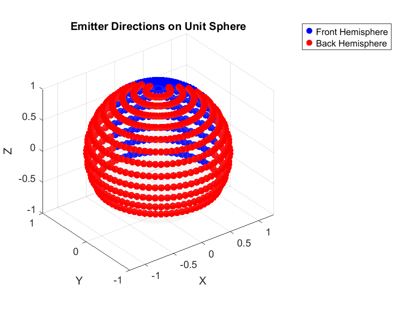

# HRTF Diagnostic Tool

If you’re reading this, you’ve likely been directed here because your HRTF dataset did not pass Pachyderm's angular distance or coverage checks. While this may feel frustrating, it’s better to identify these issues now than to risk working with data that could compromise the reliability of your project. This tool is designed to help you understand what might be going wrong and point you toward possible solutions.

If your dataset passed the aforementioned checks and loaded a binaural impulse response but the result was unexpected or contained artifacts, please reach out. Your feedback will help us to improve the robustness of this functionality.

## System Requirements

- **SOFA Toolbox for Matlab and Octave** version 2.2.0 or later is required.  
- Latest stable release: Mihocic, M., and Majdak, P. (2025). *SOFA Toolbox 2.4.0*, The SONICOM Ecosystem: Tool #14.  
  URL: [https://ecosystem.sonicom.eu/tools/14](https://ecosystem.sonicom.eu/tools/14)

## How to Use

1. Download all the provided scripts.  
2. Open MATLAB and navigate to the folder containing these scripts. You can do this by:  
   - Cutting and pasting the files into your current MATLAB folder,  
   - Double-clicking the folder in the MATLAB file browser to make it the current folder, or  
   - Right-clicking the folder and selecting **Add to Path** to include it in your MATLAB search path.  
3. Make sure the **SOFA Toolbox for Matlab and Octave** is also added to your MATLAB path, along with the folder containing your SOFA files.  
4. Open and run `runHRTFDiagnostic.m`.  
5. When prompted in the MATLAB command window, enter the filename of your HRTF dataset, including the `.sofa` extension (e.g., `myHRTFDataset.sofa`).  
6. The tool will then perform the checks and print the results in the command window.  
7. A figure window will open, allowing you to visualise the distribution of emitters in your file.

## Contributing

We welcome contributions, bug reports, and feature requests aimed at improving the tool, particularly those that enhance the specificity and reliability of the diagnostics. Please submit any issues or pull requests via the GitHub repository.

If you identify additional validation criteria that you believe should determine whether a dataset meets the quality standards for use in Pachyderm, we should consider incorporating these as active validation checks within Pachyderm itself. Please feel free to reach out so we can schedule a call to discuss the details. If you are not familiar with programming in Pachyderm, there is no need to worry — I will handle the implementation personally.
